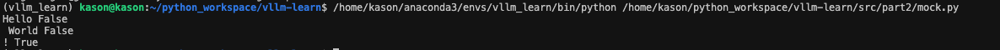
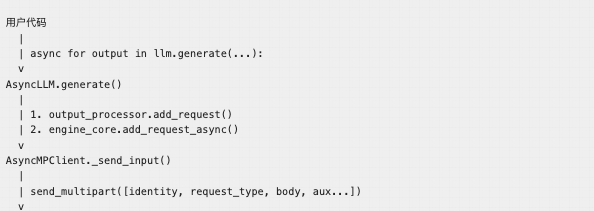
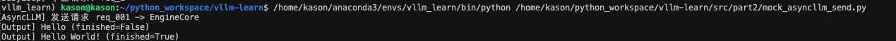
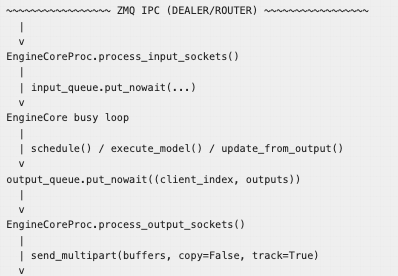
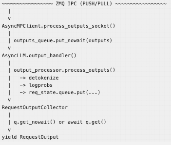

# vLLM Part2.3-Engine代码解读


接上一篇文章后续，这里主要是解读详细的代码执行流水线, 为了能够更好的理解这部分逻辑，我们一方面去理解原来的代码部分，一方面会针对性实现一个脱离vLLM代码可运行的最小执行模块来理解含义。首先本部分涉及到的vLLM的代码块有以下核心的几个源代码部分，如下所示：

> **关键源码文件**：
>
> - `vllm/vllm/v1/engine/core.py` -- `EngineCoreProc`，包含 input/output socket 线程与 `busy loop`
> - `vllm/vllm/v1/engine/async_llm.py` -- `AsyncLLM` 前端，负责 `generate()` 和 `output_handler`
> - `vllm/vllm/v1/engine/core_client.py` -- `EngineCoreClient / AsyncMPClient / SyncMPClient`，封装 ZMQ 通信
> - `vllm/vllm/v1/engine/output_processor.py` -- `OutputProcessor` 和 `RequestOutputCollector`
> - `vllm/vllm/v1/serial_utils.py` -- `MsgpackEncoder / MsgpackDecoder`，负责消息序列化与零拷贝缓冲区管理

## 1 核心代码流程:

```
                     完整请求-响应数据流
  ====================================================================

  用户代码
    |
    | async for output in llm.generate(...):
    v
  AsyncLLM.generate()
    |
    | 1. output_processor.add_request()
    | 2. engine_core.add_request_async()
    v
  AsyncMPClient._send_input()
    |
    | send_multipart([identity, request_type, body, aux...])
    v
  ~~~~~~~~~~~~~~~~~ ZMQ IPC (DEALER/ROUTER) ~~~~~~~~~~~~~~~~~
    |
    v
  EngineCoreProc.process_input_sockets()
    |
    | input_queue.put_nowait(...)
    v
  EngineCore busy loop
    |
    | schedule() / execute_model() / update_from_output()
    v
  output_queue.put_nowait((client_index, outputs))
    |
    v
  EngineCoreProc.process_output_sockets()
    |
    | send_multipart(buffers, copy=False, track=True)
    v
  ~~~~~~~~~~~~~~~~~ ZMQ IPC (PUSH/PULL) ~~~~~~~~~~~~~~~~~
    |
    v
  AsyncMPClient.process_outputs_socket()
    |
    | outputs_queue.put_nowait(outputs)
    v
  AsyncLLM.output_handler()
    |
    | output_processor.process_outputs()
    |   -> detokenize
    |   -> logprobs
    |   -> req_state.queue.put(...)
    v
  RequestOutputCollector
    |
    | q.get_nowait() or await q.get()
    v
  yield RequestOutput
```

## 1.1 最小模块复现流程

上面是整个代码执行的核心过程，为了模仿上述行为，可以通过python简单实现类似的最小化过程：

```python
import asyncio
import time
from dataclasses import dataclass, field


@dataclass
class MockEngineCoreOutput:
    request_id: str
    new_token_ids: list[int]
    finished: bool


@dataclass
class MockEngineCoreOutputs:
    outputs: list[MockEngineCoreOutput]
    timestamp: float = field(default_factory=time.time)


@dataclass
class MockRequestOutput:
    request_id: str
    text: str
    finished: bool


class MockOutputCollector:
    def __init__(self):
        self.output = None
        self.ready = asyncio.Event()

    def put(self, output):
        self.output = output
        self.ready.set()

    async def get(self):
        while self.output is None:
            await self.ready.wait()
        out = self.output
        self.output = None
        self.ready.clear()
        return out

    def get_nowait(self):
        out = self.output
        if out is not None:
            self.output = None
            self.ready.clear()
        return out


class MockEngineCore:
    def __init__(self):
        self._output_queue = asyncio.Queue()
        self._requests = {}

    def add_request(self, request_id: str, prompt: str):
        self._requests[request_id] = {"prompt": prompt, "tokens_generated": 0}
        asyncio.get_running_loop().call_later(0.05, self._step)

    def _step(self):
        outputs = []
        for req_id, state in list(self._requests.items()):
            state["tokens_generated"] += 1
            finished = state["tokens_generated"] >= 3
            outputs.append(
                MockEngineCoreOutput(
                    request_id=req_id,
                    new_token_ids=[100 + state["tokens_generated"]],
                    finished=finished,
                )
            )
            if finished:
                del self._requests[req_id]

        if outputs:
            self._output_queue.put_nowait(MockEngineCoreOutputs(outputs=outputs))
        if self._requests:
            asyncio.get_running_loop().call_later(0.05, self._step)

    async def get_output(self):
        return await self._output_queue.get()


class MockAsyncLLM:
    def __init__(self):
        self.engine_core = MockEngineCore()
        self.request_states = {}
        self._handler_started = False
        self.vocab = {101: "Hello", 102: " World", 103: "!"}

    def _start_output_handler(self):
        if self._handler_started:
            return
        self._handler_started = True
        asyncio.create_task(self._output_handler())

    async def _output_handler(self):
        while True:
            outputs = await self.engine_core.get_output()
            for output in outputs.outputs:
                collector = self.request_states.get(output.request_id)
                if collector is None:
                    continue
                collector.put(
                    MockRequestOutput(
                        request_id=output.request_id,
                        text=self.vocab.get(output.new_token_ids[0], "?"),
                        finished=output.finished,
                    )
                )
                if output.finished:
                    del self.request_states[output.request_id]

    async def generate(self, prompt: str, request_id: str):
        self._start_output_handler()
        collector = MockOutputCollector()
        self.request_states[request_id] = collector
        self.engine_core.add_request(request_id, prompt)

        finished = False
        while not finished:
            out = collector.get_nowait() or await collector.get()
            finished = out.finished
            yield out


async def main():
    llm = MockAsyncLLM()
    async for output in llm.generate("Say hello", "req_001"):
        print(output.text, output.finished)


asyncio.run(main())
```

输出结果如下：



上面mock流程图里面核心的几个模块。

通过上面的总流程图，我们可以知道总共源码走读需要分为三个部分，以ZMQ为分界线，分为三部分代码。

## 2 AsyncLLM发送数据部分



### 2.1 AsyncLLM 发送请求

从用户视角看，`AsyncLLM.generate()` 是一个异步生成器；它做了如下的几件事：

1. 确保 `output_handler` 线程已经启动
2. 把输入 prompt 处理成 `EngineCoreRequest，` 方便给到EngineCore
3. 在 `OutputProcessor` 中注册请求状态和每请求 对应的collector
4. 通过 `AsyncMPClient` 把请求发给后台 `EngineCore`

也就是说，发送请求不是“只发一个 socket 消息”，而是“前端状态注册 + 后台消息发送”两个动作一起完成。

#### 2.1.1 对应源码

**1. `AsyncLLM.generate()` 启动输出处理并等待 per-request 输出**

```python
# vllm/vllm/v1/engine/async_llm.py :: AsyncLLM.generate
self._run_output_handler()

q = await self.add_request(
    request_id,
    prompt,
    sampling_params,
    ...
)

finished = False
while not finished:
    out = q.get_nowait() or await q.get()
    finished = out.finished
    yield out
```

这段代码说明：

- 发送请求前，先确保接收通路_run_output_handler已经就位
- `generate()` 本身并不直接读 socket，而是读 `RequestOutputCollector`

**2. `_add_request()` 先注册状态，再发往引擎EngineCore**

```python
# vllm/vllm/v1/engine/async_llm.py :: AsyncLLM._add_request
self.output_processor.add_request(
    request, prompt, parent_req, index, queue
)

await self.engine_core.add_request_async(request)
```

这一步很关键。原因是如果先把请求发给 `EngineCore`，而前端还没注册好 collector，输出有可能比注册动作更早回来。

**3. `AsyncMPClient._send_input()` 负责封装多帧消息**

```python
# vllm/vllm/v1/engine/core_client.py :: AsyncMPClient._send_input
message = (request_type.value, *self.encoder.encode(request))
return self._send_input_message(message, engine, request)
```

真正发消息时，会把目标 engine 的 `identity` 加到最前面：

```python
# vllm/vllm/v1/engine/core_client.py :: AsyncMPClient._send_input_message
msg = (engine.identity,) + message
return self.input_socket.send_multipart(msg, copy=False)
```

当消息里带辅助 buffer 时，则进入带 `track=True` 的路径：

```python
future = self.input_socket.send_multipart(msg, copy=False, track=True)
```

所以输入消息的真实结构是：

```text
+----------+------------------+------------------+------------------+
| identity | request_type     | encoded_data     | aux_buffer_1 ... |
| (2 bytes)| (enum value)     | (msgpack 主体)   | (张量/数组视图)  |
+----------+------------------+------------------+------------------+
```

**4. `MsgpackEncoder.encode()` 支持主 buffer + 辅助 buffer**

```python
# vllm/vllm/v1/serial_utils.py :: MsgpackEncoder.encode
def encode(self, obj: Any) -> Sequence[bytestr]:
    try:
        self.aux_buffers = bufs = [b""]
        bufs[0] = self.encoder.encode(obj)
        return bufs
    finally:
        self.aux_buffers = None
```

这使得大对象不需要硬塞进主消息体里复制一遍，达到零拷贝的效果。

#### 2.1.2 模拟代码示例

模拟发请求收结果的简单流程

```python
import asyncio
from dataclasses import dataclass


@dataclass
class SimpleRequest:
    request_id: str
    prompt: str


@dataclass
class SimpleOutput:
    request_id: str
    text: str
    finished: bool


class SimpleOutputCollector:
    def __init__(self):
        self._queue = asyncio.Queue()

    def put(self, output):
        self._queue.put_nowait(output)

    async def get(self):
        return await self._queue.get()

    def get_nowait(self):
        try:
            return self._queue.get_nowait()
        except asyncio.QueueEmpty:
            return None


class SimpleAsyncLLM:
    def __init__(self):
        self.request_states = {}

    async def generate(self, prompt: str, request_id: str):
        collector = SimpleOutputCollector()
        request = SimpleRequest(request_id=request_id, prompt=prompt)
        self.request_states[request_id] = collector

        print(f"[AsyncLLM] 发送请求 {request.request_id} -> EngineCore")

        loop = asyncio.get_running_loop()
        loop.call_later(0.1, collector.put, SimpleOutput(request_id, "Hello", False))
        loop.call_later(0.2, collector.put, SimpleOutput(request_id, "Hello World!", True))

        finished = False
        while not finished:
            out = collector.get_nowait() or await collector.get()
            finished = out.finished
            yield out


async def main():
    llm = SimpleAsyncLLM()
    async for output in llm.generate("Say hello", "req_001"):
        print(f"[Output] {output.text} (finished={output.finished})")


asyncio.run(main())
```




---

## 3 EngineCore部分：



### 3.1 Engine 接收数据 -- EngineCore 的 input socket 线程

`EngineCore` 并不是在主循环里直接读 ZMQ socket，而是专门起一个后台线程处理输入。这样做有两个直接收益：

1. 网络 I/O 和引擎调度解耦
2. ZMQ 接收、消息解码可以和 GPU 计算阶段重叠

当前版本里，这个线程的职责是：

1. 从一个或多个 DEALER socket 接收消息帧
2. 根据 `request_type` 选择合适的 `MsgpackDecoder`
3. 把解码后的对象放入 `input_queue`
4. 对 `ABORT` 类型做额外快速通路处理

#### 3.1.1 对应源码

**1. `EngineCoreProc` 启动时创建 input 线程**

```python
# vllm/vllm/v1/engine/core.py :: EngineCoreProc.__init__
input_thread = threading.Thread(
    target=self.process_input_sockets,
    args=(addresses.inputs, addresses.coordinator_input, identity, ready_event),
    daemon=True,
)
input_thread.start()
```

这里的函数名是 `process_input_sockets`，不是旧版本中的单数 `process_input_socket`。原因也很直接：当前实现可能同时管理多个 input address。

**2. `process_input_sockets()` 负责接收与解码**

```python
# vllm/vllm/v1/engine/core.py :: EngineCoreProc.process_input_sockets
add_request_decoder = MsgpackDecoder(EngineCoreRequest)
generic_decoder = MsgpackDecoder()

while True:
    for input_socket, _ in poller.poll():
        type_frame, *data_frames = input_socket.recv_multipart(copy=False)
        request_type = EngineCoreRequestType(bytes(type_frame.buffer))

        if request_type == EngineCoreRequestType.ADD:
            request = add_request_decoder.decode(data_frames)
            request = self.preprocess_add_request(request)
        else:
            request = generic_decoder.decode(data_frames)
            if request_type == EngineCoreRequestType.ABORT:
                self.aborts_queue.put_nowait(request)

        self.input_queue.put_nowait((request_type, request))
```

这里有四个关键点：

- `recv_multipart(copy=False)`：数据传输的时候保持数据不会被复制，达到高效数据传输
- `ADD` 请求走强类型解码器
- `ABORT` 请求除了进 `input_queue`，还会先进 `aborts_queue`
- 真正的业务处理不在这个线程里做，只负责“收”和“转交”

**3. `MsgpackDecoder` 支持主消息体 + 辅助缓冲区**

```python
# vllm/vllm/v1/serial_utils.py :: MsgpackDecoder.decode
def decode(self, bufs: bytestr | Sequence[bytestr]) -> Any:
    if isinstance(bufs, bytestr):
        return self.decoder.decode(bufs)

    self.aux_buffers = bufs
    try:
        return self.decoder.decode(bufs[0])
    finally:
        self.aux_buffers = ()
```

这个接口的设计含义是：

- `bufs[0]` 是 msgpack 主体
- `bufs[1:]` 可以是**大张量、大数组**的原始缓冲区

所以 vLLM 在消息层面不是“把所有数据都塞进一个大 bytes”，而是允许主数据体和大块数据分开发送。

**4. 真正分发在 `_handle_client_request()`**

```python
# vllm/vllm/v1/engine/core.py :: EngineCoreProc._handle_client_request
if request_type == EngineCoreRequestType.ADD:
    req, request_wave = request
    self.add_request(req, request_wave)
elif request_type == EngineCoreRequestType.ABORT:
    self.abort_requests(request)
elif request_type == EngineCoreRequestType.UTILITY:
    ...
```

也就是说，input 线程只把数据放进来，真正决定“加请求、终止请求、处理 utility RPC”的，是主线程里的 client request dispatcher。

#### 3.1.2 模拟代码理解EngineCore

新建一个mock_engine_core.py， 模拟理解一下engine core的逻辑，会模拟一个SmipleEngineCore 接收请求，处理分发请求

```python
import queue
import threading
import time
from enum import Enum


class RequestType(Enum):
    ADD = b"add"
    ABORT = b"abort"


class SimpleEngineCore:
    def __init__(self):
        self.input_queue = queue.Queue()
        self.requests = {}

    def process_input_socket(self):
        simulated_requests = [
            (RequestType.ADD, {"id": "req_1", "prompt": "Hello"}),
            (RequestType.ADD, {"id": "req_2", "prompt": "World"}),
            (RequestType.ABORT, ["req_1"]),
        ]
        for req_type, data in simulated_requests:
            time.sleep(0.1)
            self.input_queue.put_nowait((req_type, data))
            print(f"[InputThread] 收到 {req_type.name}: {data}")

    def run_busy_loop(self):
        for _ in range(3):
            req_type, data = self.input_queue.get(timeout=2.0)
            self._handle_request(req_type, data)
            while not self.input_queue.empty():
                req_type, data = self.input_queue.get_nowait()
                self._handle_request(req_type, data)

    def _handle_request(self, req_type, data):
        if req_type == RequestType.ADD:
            self.requests[data["id"]] = data
            print(f"[BusyLoop] 添加请求: {data['id']}")
        elif req_type == RequestType.ABORT:
            for rid in data:
                self.requests.pop(rid, None)
                print(f"[BusyLoop] 中止请求: {rid}")


engine = SimpleEngineCore()
threading.Thread(target=engine.process_input_socket, daemon=True).start()
engine.run_busy_loop()
```

---

### 3.2 Engine 发送数据 -- EngineCore 的 output socket 线程

发送侧和接收侧是对称的：`EngineCore` 也会起单独线程把结果推给前端。

这个线程的核心职责是：

1. 从 `output_queue` 取出 `EngineCoreOutputs`
2. 序列化成 msgpack 主体 + 辅助缓冲区
3. 用 ZMQ `PUSH` 零拷贝发送给前端
4. 管理 buffer 复用，减少内存分配

它的存在意义很大：模型执行主循环体只关心“产出结果”，不关心底层 socket 什么时候发完， 所以走的是PUSH/PULL模式。

#### 3.2.1 对应源码

**1. `EngineCoreProc` 启动时创建 output 线程**

```python
# vllm/vllm/v1/engine/core.py :: EngineCoreProc.__init__
self.output_thread = threading.Thread(
    target=self.process_output_sockets,
    args=(addresses.outputs, addresses.coordinator_output, self.engine_index),
    daemon=True,
)
self.output_thread.start()
```

**2. `process_output_sockets()` 的核心循环**

```python
# vllm/vllm/v1/engine/core.py :: EngineCoreProc.process_output_sockets
encoder = MsgpackEncoder()
reuse_buffers: list[bytearray] = []
pending = deque[tuple[zmq.MessageTracker, Any, bytearray]]()

while True:
    output = self.output_queue.get()
    if output == EngineCoreProc.ENGINE_CORE_DEAD:
        for socket in sockets:
            socket.send(output)
        break

    client_index, outputs = output
    outputs.engine_index = engine_index

    while pending and pending[-1][0].done:
        reuse_buffers.append(pending.pop()[2])

    buffer = reuse_buffers.pop() if reuse_buffers else bytearray()
    buffers = encoder.encode_into(outputs, buffer)
    tracker = sockets[client_index].send_multipart(
        buffers, copy=False, track=True
    )
```

#### 这里的设计重点有三层。

**第一层：buffer 复用**

```python
buffer = reuse_buffers.pop() if reuse_buffers else bytearray()
buffers = encoder.encode_into(outputs, buffer)
```

同一个 `bytearray` 会被反复拿来编码，避免每轮都新建大对象。

**第二层：零拷贝发送**

```python
tracker = sockets[client_index].send_multipart(
    buffers, copy=False, track=True
)
```

- `copy=False` 表示尽量不拷贝
- `track=True` 返回 `MessageTracker`

这样 ZMQ 可以异步发送，而 Python 侧知道什么时候这块 buffer 可以安全回收。

**第三层：发送完成前保持引用**

```python
if not tracker.done:
    ref = outputs if len(buffers) > 1 else None
    pending.appendleft((tracker, ref, buffer))
```

如果有辅助 buffer，例如张量底层内存，发送还没完成时必须把 `outputs` 和 `buffer` 都留住，否则底层数据可能被 GC 或复用掉。

**3. `MsgpackEncoder.encode_into()` 直接写入既有 buffer**

```python
# vllm/vllm/v1/serial_utils.py :: MsgpackEncoder.encode_into
def encode_into(self, obj: Any, buf: bytearray) -> Sequence[bytestr]:
    try:
        self.aux_buffers = [buf]
        bufs = self.aux_buffers
        self.encoder.encode_into(obj, buf)
        return bufs
    finally:
        self.aux_buffers = None
```

如果对象里还有大张量，`enc_hook()` 还会把它们挂进 `aux_buffers`，形成：

- 主编码 buffer
- 额外 tensor / ndarray backing buffers

#### 3.2.2 数据流图

```text
             EngineCore output socket 线程的 buffer 生命周期
  ====================================================================

  output_queue.get()
       |
       v
  取出 (client_index, EngineCoreOutputs)
       |
       v
  从 reuse_buffers 取 buffer 或新建 bytearray
       |
       v
  MsgpackEncoder.encode_into(outputs, buffer)
       |
       | 返回 [main_buffer, aux_buf_1, aux_buf_2, ...]
       v
  socket.send_multipart(buffers, copy=False, track=True)
       |
       v
  pending.append((tracker, outputs_ref, buffer))
       |
       | tracker.done == True
       v
  buffer 回收到 reuse_buffers
```

---

## 4 AsyncLLM结果处理部分



### 4.1 AsyncLLM接收结果-- output_handler 和 OutputProcessor

EngineCore结果发送完成之后，前端还需要持续把后台输出拉回来，再分发给每个请求自己的异步生成器。这里涉及三个核心角色：

1. `AsyncMPClient.process_outputs_socket()`：从 ZMQ PULL socket 拉原始输出
2. `AsyncLLM.output_handler()`：批量处理 `EngineCoreOutputs`
3. `OutputProcessor`：做 detokenize、logprobs、封装 `RequestOutput`

最后，结果会进入 `RequestOutputCollector`，再被 `generate()` 协程消费。

#### 4.1.1 源码解析

**1. `AsyncMPClient` 的 output queue task 持续从 socket 拉结果**

```python
# vllm/vllm/v1/engine/core_client.py :: AsyncMPClient._ensure_output_queue_task
async def process_outputs_socket():
    try:
        while True:
            frames = await output_socket.recv_multipart(copy=False)
            resources.validate_alive(frames)
            outputs: EngineCoreOutputs = decoder.decode(frames)
            if outputs.utility_output:
                _process_utility_output(outputs.utility_output, utility_results)
                continue

            if outputs.outputs or outputs.scheduler_stats:
                outputs_queue.put_nowait(outputs)
    except Exception as e:
        outputs_queue.put_nowait(e)
```

这一层只负责：

- 收数据
- 解码数据
- 放进 `outputs_queue`

这部分代码还不做 detokenize。

**2. `AsyncLLM.output_handler()` 分块处理输出**

```python
# vllm/vllm/v1/engine/async_llm.py :: output_handler
outputs = await engine_core.get_output_async()
num_outputs = len(outputs.outputs)

if num_outputs <= VLLM_V1_OUTPUT_PROC_CHUNK_SIZE:
    slices = (outputs.outputs,)
else:
    slices = np.array_split(
        outputs.outputs,
        cdiv(num_outputs, VLLM_V1_OUTPUT_PROC_CHUNK_SIZE),
    )

for i, outputs_slice in enumerate(slices):
    processed_outputs = output_processor.process_outputs(
        outputs_slice, outputs.timestamp, iteration_stats
    )
    if i + 1 < len(slices):
        await asyncio.sleep(0)
    await engine_core.abort_requests_async(processed_outputs.reqs_to_abort)
```

为什么这里要分块，还要 `await asyncio.sleep(0)`？ 主要是为了考虑下面三个点

- 一个 batch 的输出可能很多
- 如果一次性处理完，事件循环会被长时间占住
- `sleep(0)` 的作用是主动让出控制权，让别的协程先跑一下

**3. `OutputProcessor.process_outputs()` 真正生成 `RequestOutput`**

```python
# vllm/vllm/v1/engine/output_processor.py :: OutputProcessor.process_outputs
for engine_core_output in engine_core_outputs:
    req_id = engine_core_output.request_id
    req_state = self.request_states.get(req_id)
    if req_state is None:
        continue

    self._update_stats_from_output(...)
    stop_string = req_state.detokenizer.update(...)
    req_state.logprobs_processor.update_from_output(engine_core_output)

    if request_output := req_state.make_request_output(...):
        if req_state.queue is not None:
            req_state.queue.put(request_output)
        else:
            request_outputs.append(request_output)

    if finish_reason is not None:
        self.request_states.pop(req_id)
```

这里完成了四个动作：

- 更新统计信息，方便进行metrics统计
- 增量 detokenize
- 更新 logprobs
- 按请求分发输出，归还token结果给对应的请求

**4. `RequestOutputCollector` 是 generate() 的桥梁**

```python
# vllm/vllm/v1/engine/output_processor.py :: RequestOutputCollector
def put(self, output):
    if self.output is None or isinstance(output, Exception):
        self.output = output
        self.ready.set()
    elif isinstance(self.output, RequestOutput):
        self.output.add(output, aggregate=self.aggregate)

async def get(self):
    while (output := self.output) is None:
        await self.ready.wait()
    self.output = None
    self.ready.clear()
    return output
```

它不是普通队列，而是“单槽位 + 可合并输出”的结构。这样做的好处是：

- 消费者慢时，不会无限积压
- delta 输出可以合并，减轻调度压力

## 5 针对该模块的思考

如果我们要在现有通路里增加一种新的前端控制请求，比如“暂停请求生成”，大概得要改哪些组件？（考虑 `前端发送 -> EngineCore 接收 -> 主循环处理 -> 前端状态同步` ）。
